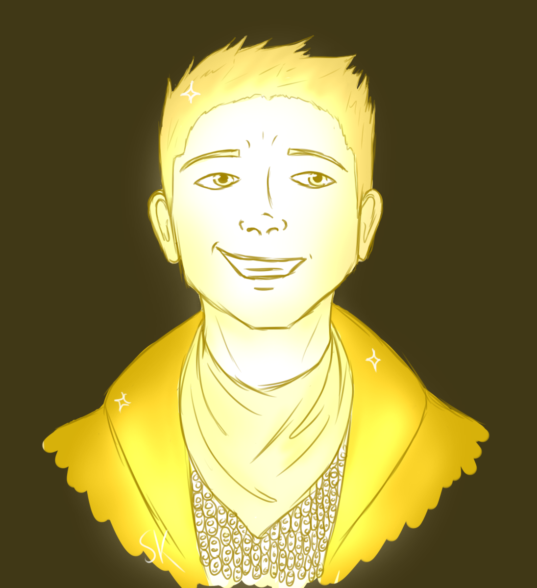
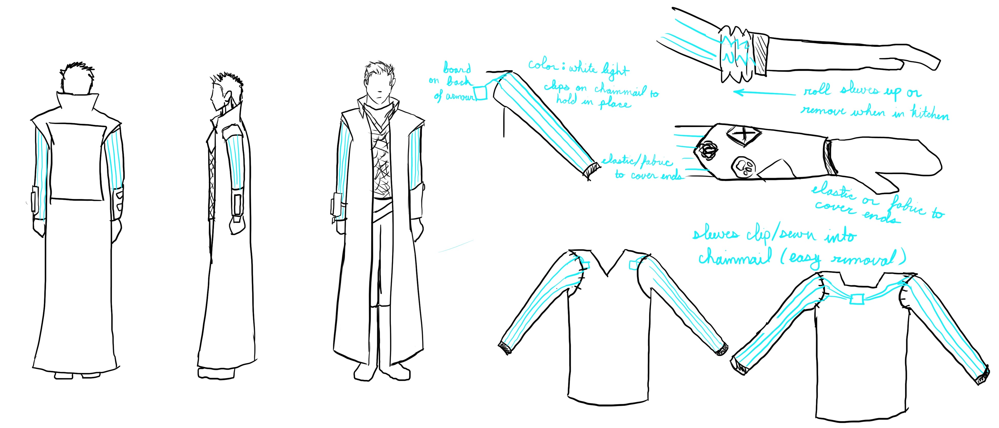
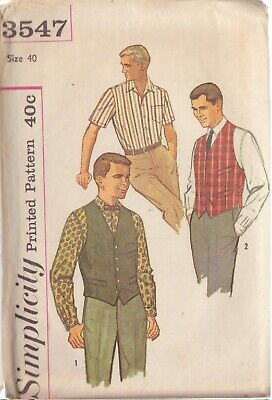
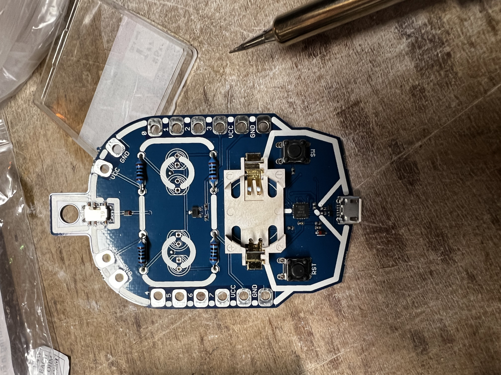
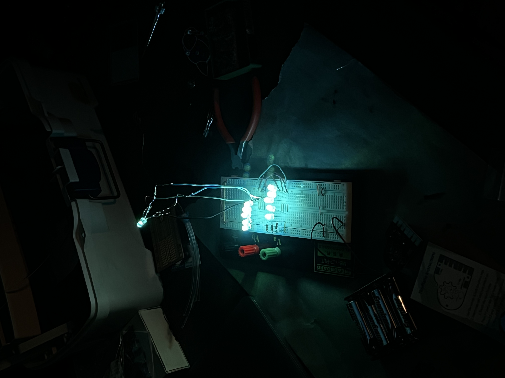
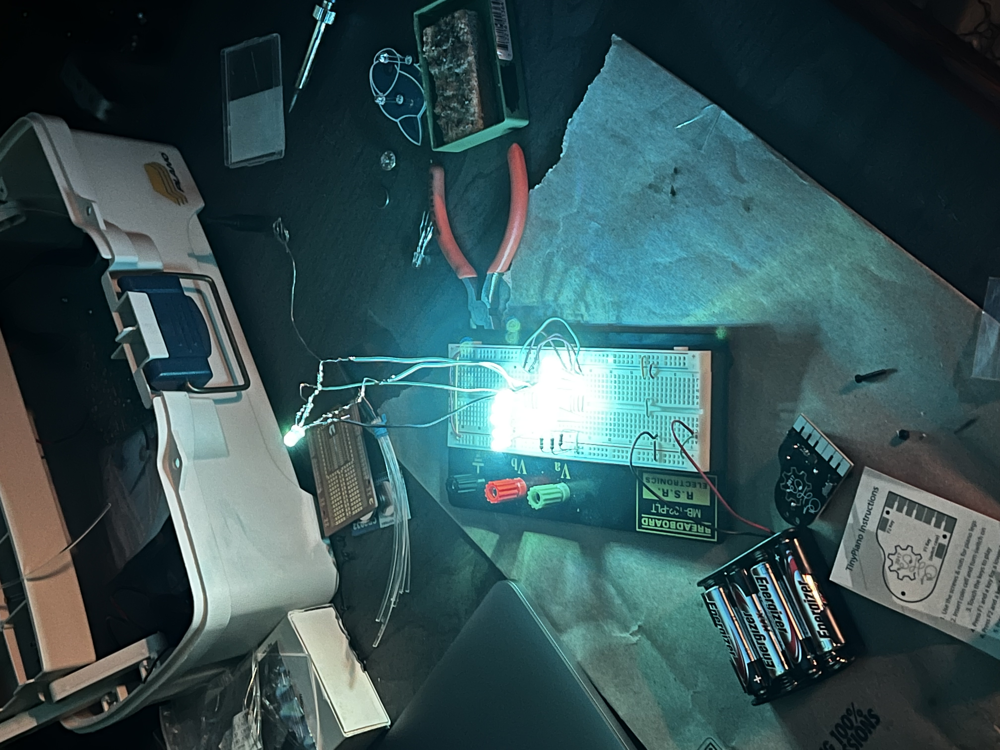
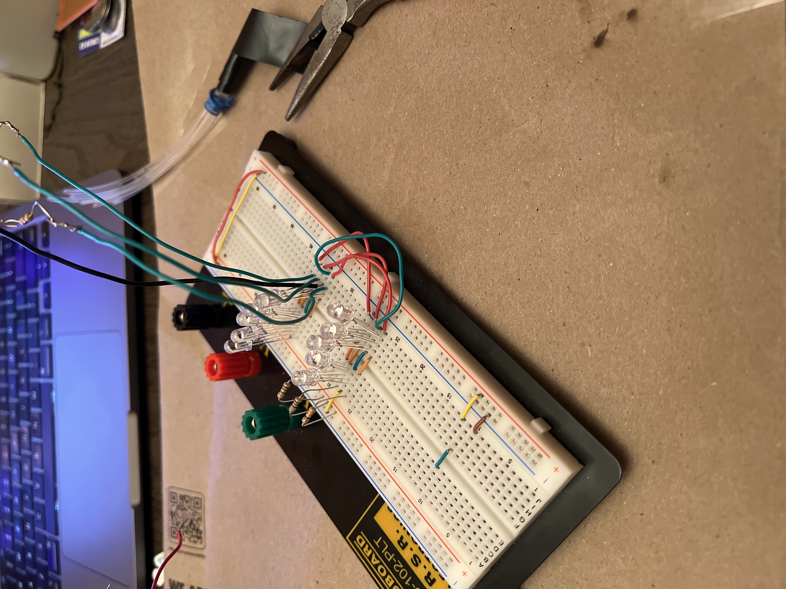

# Tarth's First Ascension
 
 

# Background
[Dystopia Rising](dystopiarising.com) is a national, ongoing, live action roleplaying game. The general theme of the LARP is a post zombie apocalypse world. My character is a Sainthood Ascensorite named Tarth (he/him). Every 100 XP, Ascensorites get a "body" modification and I have chosen light-up arms. 

I'm doing this via a tutorial called [Color Changing Fiber Optic Fabric](https://www.instructables.com/Color-Changing-Fiber-Optic-Fabric/) which involves weaving fiber optic wire through tulle fabric and attaching LEDs to the end so that it lights up. I'm connecting this to an PCB so that I can program the RGB LEDs to become different colors in case I want to modify them at any time.

# List of Components
### Consumables
- string of addressable LEDs
- Arduino compatible board
- 1 yard of tulle
### Tools
- computer with Arduino IDE installed (I use a 2020 Macbook Pro 13")
- sewing machine
- breadboard

Note: these are only the items I used for the final product, not over the lifespan of the project

# Steps I Followed
1. sew sleeves to vest
2. construct PCB and program LEDs
3. attach LEDs to vest and weave fiber optic wire
4. testing
5. Rock on! 

# Sewing
One thing I had to keep in the forefront of my mind when starting to sew the sleeves was the ability to roll my sleeves up. I am one of the kitchen guides for the Colorado game, so being able to roll the sleeves up to make meals was important. I decided to go with a buttondown shirt style of sleeve, using a vintage buttondown pattern from [Simplicty](https://simplicity.com) which I inherited from my grandma.

I bought 2 yards of white tulle from [Joanns](https://www.joann.com). I chose white because it meshed  with the fiber optic cable better and I plan to wear a white long sleeve undershirt to reflect the light better. Since I was only making sleeves, 2 yards was far too much fabric and I have lots of leftovers, however this meant that I didn't have to worry about messing up since I could make more.
Once cut, the sleeves were sewn to a long vest from my original costume. Once the sleeves were added, I tailored them to fit my arm more snuggly, since the pattern was for looser sleeves. I also added a pocket to the vest to house the PCB.
I tested clear thread and found that it was too slippery to hold the tulle and opted for regular white thread. Sewing tulle to tulle is an interesting process and what ensured my success was:
1. sew in a zigzag pattern with the longest stitch length possible
2. sew over the same area at least twice to ensure no slippage

# Circuitry
Connecting and programming to the PCB was far more interesting and fun than I predicted. I felt like I was back in my robotics class during college, using many of my old tools from my electrical engineering courses. Most of the start of the project was refamilurizing myself with wiring and programming with Arduino and testing how much power I would need.
## The Board
My original plan was to use a [Watterott Robo-Badge](https://learn.watterott.com/learn-to-solder/robo-badge/). Unfortunately the board I was using refused to connect to my computer, so I bought a new board from SparkFun. An additional benefit for getting a new board meant I could restore the boot loader on the Watterott and other Arduino boards I have so I can use them for future projects.

 
## The LEDS
I bought a package of programmable LEDs from SparkFun which I intended on wiring manually. After spending multiple weeks playing with them and genuinely having a fantastic time with them, I realized hooking them up manual would be very time comsuming and the final product would be cumbersome.

 

I decided to buy a strand of programmable LEDs instead. Due to time constrants and shipping time, I bought a strand of addressible LEDs on Amazon.
## Power
I tested the power via a breadboard, alternating betwee a 4 pack of AA batteries (approximately 6V) and 3.3V coin battery. The Watterott has a place for a 3.3V battery but when the board failed, I switched to the AA batteries. Though clunkier, the higher voltage allowed the LEDs to be significantly brighter and the batteries are easier to replace.

 

# Fiber Optic Cable
The fiber optic cable was the easiest thing to acquire and work with. I tested two sizes:
- 0.03in/0.75mm diameter
- 0.08in/2mm diameter

The 0.75mm was a lot smaller than I anticipated and didn't carry the light as well as the 2mm cable. I did some testing between the two and played with the idea of combining the two sizes on the sleeve. The general feeling I was going for was that the light was coming from my character's veins.

# Crafting Review
This project reignited my love of crafting. It brought back a lot of memories of my first two years of college which was difficult for me, but I was reminded of the parts that I enjoyed and reignited my passion for circuitry and programming.
I definitely felt ambitious starting this project since it would require combining sewing, wiring, and programmng while taking into account the amount of wear-and-tear caused by LARP and keeping the overall project small so I could still move without incident.

# Future Developments and Testing
- switch out large strand of LEDs with smaller LEDs
- add switches to alternate colors
- add Bluetooth connection so I can control LEDs via my phone
- develop an Apple Watch app and complication so I can control LEDs via my watch
